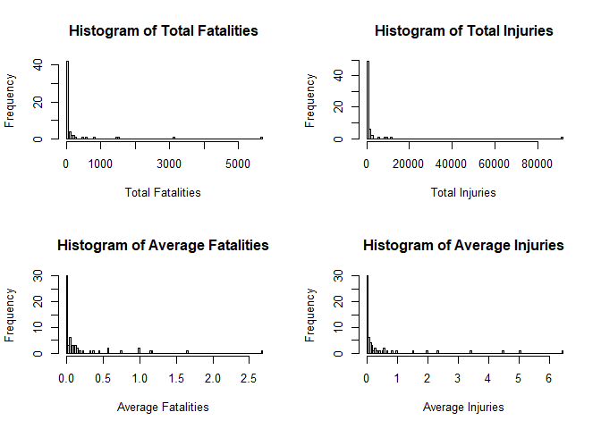
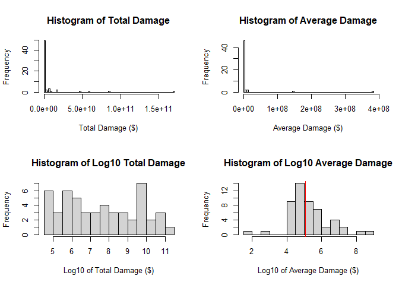

## Synopsis/Abstract
In this project, I analyzed NOAA's "Storm Data" database, as an assignment for
Reproducible Research, the fifth course in the John's Hopkins Data Science
Specialization on Coursera. The goal of the analysis was to determine which
events in the database were the most damaging, both in human terms (fatalities
and injuries) and economic terms (property damage). The analysis was performed
using the following R code.  

I found that the events that had caused the greatest
human damage in total were tornadoes, both in terms of fatalities (5661) and
injuries (91407). However, the deadliest events on an individual basis were 
marine accidents/mishaps (2.67 fatalities/event), and the most injurious were
tsunamis (6.45 injuries/event).  

In property damage terms, floods did the greatest total damage ($168212215589),
and hurricanes/typhoons were the most damaging individually ($381055402/event).

In both sections, after answering the initial questions, I explored the
distributions of the totals and averages calculated. Most distributions showed
that most types of events are largely harmless, with a few having extremely
high values in a pattern resembling a power law (unconfirmed). However, the
average economic damage of events seemed to drop off extremely sharply, and
when plotted on a semi-log histogram, showed an interesting clustering rather
than the flat distribution characteristic of a power law.

## Preparing the data


```r
library(dplyr) #show code, but hide messages for including packages
```

### Loading in raw data
First, check if a file called data.csv.bz2 is already in the local directory. If
not, download the data from the URL given in the assignment, using the file name
data.csv.bz2. Once the data file is in the local directory, read into R.


```r
if (!file.exists("data.csv.bz2")) {
  download.file("https://d396qusza40orc.cloudfront.net/repdata%2Fdata%2FStormData.csv.bz2", "data.csv.bz2")
}
raw <- read.csv("data.csv.bz2")
```

### Inspecting the data

Next, inspect the data to determine if it needs cleaning and/or pre-processing.


```r
dim(raw) #how many rows and columns?
```

```
## [1] 902297     37
```

```r
names(raw) #are the columns named, and if so what are they?
```

```
##  [1] "STATE__"    "BGN_DATE"   "BGN_TIME"   "TIME_ZONE"  "COUNTY"    
##  [6] "COUNTYNAME" "STATE"      "EVTYPE"     "BGN_RANGE"  "BGN_AZI"   
## [11] "BGN_LOCATI" "END_DATE"   "END_TIME"   "COUNTY_END" "COUNTYENDN"
## [16] "END_RANGE"  "END_AZI"    "END_LOCATI" "LENGTH"     "WIDTH"     
## [21] "F"          "MAG"        "FATALITIES" "INJURIES"   "PROPDMG"   
## [26] "PROPDMGEXP" "CROPDMG"    "CROPDMGEXP" "WFO"        "STATEOFFIC"
## [31] "ZONENAMES"  "LATITUDE"   "LONGITUDE"  "LATITUDE_E" "LONGITUDE_"
## [36] "REMARKS"    "REFNUM"
```

```r
sapply(raw, FUN=function(x) sum(is.na(x))) #how many missing values and where?
```

```
##    STATE__   BGN_DATE   BGN_TIME  TIME_ZONE     COUNTY COUNTYNAME      STATE 
##          0          0          0          0          0          0          0 
##     EVTYPE  BGN_RANGE    BGN_AZI BGN_LOCATI   END_DATE   END_TIME COUNTY_END 
##          0          0          0          0          0          0          0 
## COUNTYENDN  END_RANGE    END_AZI END_LOCATI     LENGTH      WIDTH          F 
##     902297          0          0          0          0          0     843563 
##        MAG FATALITIES   INJURIES    PROPDMG PROPDMGEXP    CROPDMG CROPDMGEXP 
##          0          0          0          0          0          0          0 
##        WFO STATEOFFIC  ZONENAMES   LATITUDE  LONGITUDE LATITUDE_E LONGITUDE_ 
##          0          0          0         47          0         40          0 
##    REMARKS     REFNUM 
##          0          0
```

```r
length(levels(factor(raw$EVTYPE))) #how many event types are there?
```

```
## [1] 985
```

```r
head(levels(factor(raw$EVTYPE))) #what are the types?
```

```
## [1] "   HIGH SURF ADVISORY" " COASTAL FLOOD"        " FLASH FLOOD"         
## [4] " LIGHTNING"            " TSTM WIND"            " TSTM WIND (G45)"
```

Data size looks sufficient (902297 rows), columns are tidy and meaningfully
labeled, some data is missing but in relatively unimportant columns. However,
the classifications of the events themselves seems like it needs pre-processing,
since two separate kinds of floods and two separate kinds of thunderstorm winds
are listed separately.

### Pre-processing the data

Create new categories using keywords, and ensure that all (meaningful) rows are
included at least once. Rows were regarded as not meaningful if they:  
1. don't describe an event ("Summary of May 13", "Apache County")  
2. are highly ambiguous ("Excessive", "Record temperature")  
3. don't make any sense whatsoever ("Remnants of Floyd", "Southeast")  

Categories were created by adding to the list of strings to search for until all 
un-included types were not meaningful observations. Some researchers' discretion
is unavoidable with this method, but the code below is a record of exactly how
event types were grouped.

Do all of this in a copy of the data, not the original.


```r
data <- raw
data$included = FALSE #create new variable to keep track of inclusion
data$newType = character(length=nrow(data)) #create new variable to track new type membership
types <- c("avalanche|avalance", "blizzard", "coastal storm|coastalstorm", "cold|low temp|record low", "cool", "current", "dam break|dam fail", "downburst|microburst", "drought|dry|dri|below normal precip", "drowning", "dust", "erosion|erosin", "excessive precip|heavy precip|record precip", "fire", "flood|floood", "fog", "freez", "frost", "funnel cloud|funnel", "glaze", "hail", "heat|hot|high temp|record high", "high water|rising water", "high waves", "hurricane|typhoon", "hyperthermia", "hypothermia", "ice|icy", "landslide|land", "lightning|lighting|ligntning", "marine accident|marine mishap", "mixed precip", "mudslide|mud", "northern lights", "other", "rain|shower", "red flag criteria", "rockslide|rock", "rogue wave", "seas", "seiche", "sleet", "smoke", "snow", "stream|strm", "surf", "surge", "swell", "thunderstorm|tstm$", "tide", "tornado|torndao|gustnado", "tropical depression", "tropical storm", "tsunami", "volcanic", "vog", "wall cloud", "warm", "waterspout|water spout|wayterspout", "wet", "wind|wnd|tstm wind|tstmw$", "winter|wintry")
for (str in types) {
  mask <- grepl(paste("(?i)", str, sep=""), data$EVTYPE)
  category <- data[mask, ]
  data[mask, ]$included <- TRUE
  data[mask, ]$newType <- paste(data[mask, ]$newType, str, sep=",")
}
mean(data$included) #coverage of original rows
```

```
## [1] 0.9997695
```

```r
levels(factor(data[data$included==F, ]$EVTYPE)) #non-meaningful types, left out
```

```
##  [1] "?"                      "APACHE COUNTY"          "EXCESSIVE"             
##  [4] "HEAVY MIX"              "HIGH"                   "Metro Storm, May 26"   
##  [7] "MILD PATTERN"           "MONTHLY PRECIPITATION"  "MONTHLY TEMPERATURE"   
## [10] "No Severe Weather"      "NONE"                   "NORMAL PRECIPITATION"  
## [13] "Record temperature"     "RECORD TEMPERATURE"     "Record Temperatures"   
## [16] "RECORD TEMPERATURES"    "REMNANTS OF FLOYD"      "SEVERE TURBULENCE"     
## [19] "SOUTHEAST"              "Summary August 10"      "Summary August 11"     
## [22] "Summary August 17"      "Summary August 2-3"     "Summary August 21"     
## [25] "Summary August 28"      "Summary August 4"       "Summary August 7"      
## [28] "Summary August 9"       "Summary Jan 17"         "Summary July 23-24"    
## [31] "Summary June 18-19"     "Summary June 5-6"       "Summary June 6"        
## [34] "Summary of April 12"    "Summary of April 13"    "Summary of April 21"   
## [37] "Summary of April 27"    "Summary of April 3rd"   "Summary of August 1"   
## [40] "Summary of July 11"     "Summary of July 2"      "Summary of July 22"    
## [43] "Summary of July 26"     "Summary of July 29"     "Summary of July 3"     
## [46] "Summary of June 10"     "Summary of June 11"     "Summary of June 12"    
## [49] "Summary of June 13"     "Summary of June 15"     "Summary of June 16"    
## [52] "Summary of June 18"     "Summary of June 23"     "Summary of June 24"    
## [55] "Summary of June 3"      "Summary of June 30"     "Summary of June 4"     
## [58] "Summary of June 6"      "Summary of March 14"    "Summary of March 23"   
## [61] "Summary of March 24"    "SUMMARY OF MARCH 24-25" "SUMMARY OF MARCH 27"   
## [64] "SUMMARY OF MARCH 29"    "Summary of May 10"      "Summary of May 13"     
## [67] "Summary of May 14"      "Summary of May 22"      "Summary of May 22 am"  
## [70] "Summary of May 22 pm"   "Summary of May 26 am"   "Summary of May 26 pm"  
## [73] "Summary of May 31 am"   "Summary of May 31 pm"   "Summary of May 9-10"   
## [76] "Summary Sept. 25-26"    "Summary September 20"   "Summary September 23"  
## [79] "Summary September 3"    "Summary September 4"    "Summary: Nov. 16"      
## [82] "Summary: Nov. 6-7"      "Summary: Oct. 20-21"    "Summary: October 31"   
## [85] "Summary: Sept. 18"      "Temperature record"     "URBAN AND SMALL"       
## [88] "URBAN SMALL"            "URBAN/SMALL"
```

```r
length(data$included[data$included == FALSE])  #total rows left out
```

```
## [1] 208
```

Check that it worked as intended:


```r
head(table(data$newType)) #first row's new type is "", for non-meaningful
```

```
## 
##                                           
##                                       208 
##                       ,avalanche|avalance 
##                                       387 
##         ,avalanche|avalance,blizzard,snow 
##                                         1 
##                                 ,blizzard 
##                                      2723 
##               ,blizzard,freez,rain|shower 
##                                         1 
## ,blizzard,freez,wind|wnd|tstm wind|tstmw$ 
##                                         1
```

## Question 1: Across the United States, which types of events are most harmful with respect to population health?

### Analysis

First, subset out only fields which are relevant.


```r
popData <- data[c("newType", "FATALITIES", "INJURIES")]
```

Next, calculate total and average fatalities for each newType. Use a for loop
to iterate through list of types, and grep for entries to include.


```r
popDamage <- data.frame(type = character(), TOTAL_FATALITIES = integer(), TOTAL_INJURIES = integer(), AVERAGE_FATALITIES = double(), AVERAGE_INJURIES = double())
for (str in types) {
  mask <- grepl(str, popData$newType)
  category <- data[mask, ]
  popDamage[nrow(popDamage) + 1, ] = list(str, sum(category$FATALITIES), sum(category$INJURIES), mean(category$FATALITIES), mean(category$INJURIES))
}
```

### Results: main question

Check simple maxima for total and average of injuries and fatalities.


```r
popDamage[which(popDamage$TOTAL_FATALITIES==max(popDamage$TOTAL_FATALITIES)), ]$type #type with most total fatalities
```

```
## [1] "tornado|torndao|gustnado"
```

```r
max(popDamage$TOTAL_FATALITIES) #most total fatalities
```

```
## [1] 5661
```

```r
popDamage[which(popDamage$TOTAL_INJURIES==max(popDamage$TOTAL_INJURIES)), ]$type #type with most total injuries
```

```
## [1] "tornado|torndao|gustnado"
```

```r
max(popDamage$TOTAL_INJURIES) #most total injuries
```

```
## [1] 91407
```

```r
popDamage[which(popDamage$AVERAGE_FATALITIES==max(popDamage$AVERAGE_FATALITIES)), ]$type #type with most average fatalities per event
```

```
## [1] "marine accident|marine mishap"
```

```r
max(popDamage$AVERAGE_FATALITIES) #most average fatalities
```

```
## [1] 2.666667
```

```r
popDamage[which(popDamage$AVERAGE_INJURIES==max(popDamage$AVERAGE_INJURIES)), ]$type #type with most average injuries per event
```

```
## [1] "tsunami"
```

```r
max(popDamage$AVERAGE_INJURIES) #most average injuries
```

```
## [1] 6.45
```

### Results: further exploration

When plotting histograms of the totals and averages of fatalities and injuries,
it is clear that most types are low-impact, and a few high-impact types make up
the bulk of the fatalities and injuries recorded - similarly, most events are
not dangerous individually, and only a few dangerous events with much higher
per-event injury and fatality rates.


```r
par(mfrow=c(2,2))
hist(popDamage$TOTAL_FATALITIES, breaks=100, xlab="Total Fatalities", ylab="Frequency", main="Histogram of Total Fatalities")
hist(popDamage$TOTAL_INJURIES, breaks=100, xlab="Total Injuries", ylab="Frequency", main="Histogram of Total Injuries")
hist(popDamage$AVERAGE_FATALITIES, breaks=100, xlab="Average Fatalities", ylab="Frequency", main="Histogram of Average Fatalities")
hist(popDamage$AVERAGE_INJURIES, breaks=100, xlab="Average Injuries", ylab="Frequency", main="Histogram of Average Injuries")
```

<!-- -->

## Question 2: Across the United States, which types of events have the greatest economic consequences?

### Analysis

First, subset out only fields which are relevant.


```r
econData <- data[c("newType", "PROPDMG", "PROPDMGEXP")]
```

Since the coefficient and the exponent of property damage are stored separately
for each entry, use both to calculate the true numeric property damage. 
Calculated assuming exponents B=10^9, M=10^6, K=10^3, H=10^2. PROPDMGEXP values
"+", "-", and "?" were set to NA.


```r
calcPropDmg <- function(row) {  #define function to apply to each row
  exp <- row[3]
  val <- as.numeric(row[2])
  if (exp %in% c(0,1,2,3,4,5,6,7,8)) {
    return(val * 10^as.numeric(exp))
  } else if (exp == 'B'){
    return(val * 10^9)
  } else if (exp == 'M' | exp == 'm') {
    return(val * 10^6)
  } else if (exp == 'K') {
    return(val * 10^3)
  } else if (exp == 'H' | exp == 'h') {
    return(val * 10^2)
  } else {
    return(NA)
  }
}
econData$realDamage <- apply(econData, MARGIN=1, FUN=calcPropDmg) #apply function
```

Next, calculate total and average fatalities for each newType. Use a for loop
to iterate through list of types, and grep for entries to include.


```r
econDamage <- data.frame(type = character(), TOTAL_DAMAGE = integer(), AVERAGE_DAMAGE = double())
for (str in types) {
  mask <- grepl(str, econData$newType)
  category <- econData[mask, ]$realDamage
  econDamage[nrow(econDamage) + 1, ] = list(str, sum(category, na.rm=T), mean(category, na.rm=T))
}
```

### Results: main question

Check simple maxima for total and average of property damage


```r
econDamage[which(econDamage$TOTAL_DAMAGE == max(econDamage$TOTAL_DAMAGE, na.rm = T)), "type" ] #type with most total economic (property) damage
```

```
## [1] "flood|floood"
```

```r
max(econDamage$TOTAL_DAMAGE, na.rm = T) #amount of total economic damage
```

```
## [1] 168212215589
```

```r
econDamage[which(econDamage$AVERAGE_DAMAGE == max(econDamage$AVERAGE_DAMAGE, na.rm = T)), "type" ] #type with most average economic damage per event
```

```
## [1] "hurricane|typhoon"
```

```r
max(econDamage$AVERAGE_DAMAGE, na.rm = T) #average economic damage
```

```
## [1] 381055402
```

### Results: further exploration

Like with human damage, we again see sharp drops frequency with increasing total
and average economic damage. A few types of events are responsible for the bulk
of all economic damage from these disasters, and a few types of events are by
far the most damaging on a per-event basis. In this case, the drop appears even
sharper in terms of average damage than absolute damage. Interesting, on a
semi-log histogram (x=log(intensity), y=frequency), total damage seems about
evenly distributed, while average damage shows a significant clustering, with a
median of 5.056189 on a log scale,
or 1.1476613\times 10^{5} dollars per event.


```r
par(mfrow=c(2,2))
hist(econDamage$TOTAL_DAMAGE, breaks=100, xlab="Total Damage ($)", ylab="Frequency", main="Histogram of Total Damage")
hist(econDamage$AVERAGE_DAMAGE, breaks=100, xlab="Average Damage ($)", ylab="Frequency", main="Histogram of Average Damage")
hist(log10(econDamage$TOTAL_DAMAGE), breaks=10, xlab="Log10 of Total Damage ($)", ylab="Frequency", main="Histogram of Log10 Total Damage")
hist(log10(econDamage$AVERAGE_DAMAGE), breaks=10, xlab="Log10 of Average Damage ($)", ylab="Frequency", main="Histogram of Log10 Average Damage")
abline(v=median(log10(econDamage$AVERAGE_DAMAGE), na.rm=T), col="red")
```

<!-- -->
